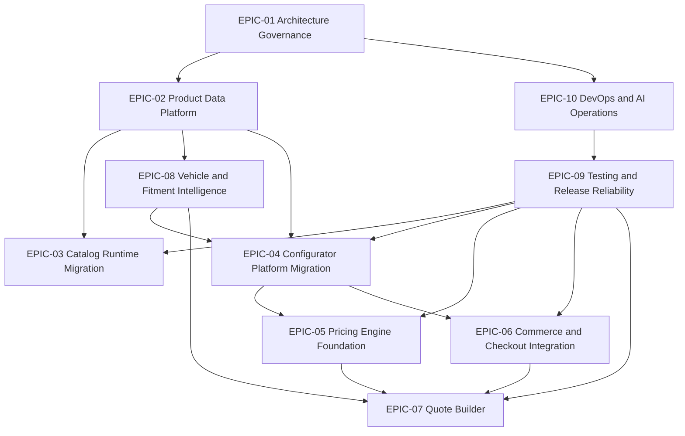
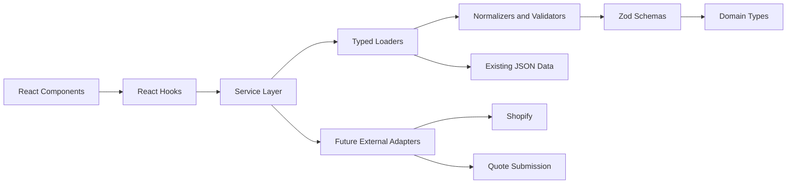
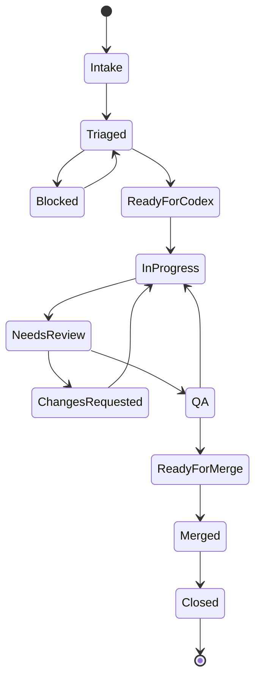

# Dependency Map

## Epic Dependencies

| Epic | Depends on | Blocks |
|---|---|---|
| EPIC-01 Platform Architecture Governance | Repository standards, existing architecture docs | All platform migrations |
| EPIC-02 Product Data Platform | EPIC-01 | EPIC-03, EPIC-04, EPIC-06, EPIC-08 |
| EPIC-03 Catalog Runtime Migration | EPIC-01, EPIC-02 | Navigation cleanup, product discovery features |
| EPIC-04 Configurator Platform Migration | EPIC-01, EPIC-02, EPIC-08 | EPIC-05, EPIC-07, advanced commerce readiness |
| EPIC-05 Pricing Engine Foundation | EPIC-01, EPIC-04, EPIC-06 contracts | EPIC-07, price display features |
| EPIC-06 Commerce and Checkout Integration | EPIC-01, EPIC-02, EPIC-04 SKU contracts | EPIC-07, checkout improvements |
| EPIC-07 Quote Builder and Review Workflow | EPIC-04, EPIC-05, EPIC-06, EPIC-08 | Sales automation and quote submission |
| EPIC-08 Vehicle and Fitment Intelligence | EPIC-01, EPIC-02 | EPIC-04, EPIC-07 |
| EPIC-09 Testing, QA, and Release Reliability | EPIC-01, EPIC-10 | All release candidates |
| EPIC-10 DevOps, Environments, and AI Operations | EPIC-01 | EPIC-09 and production releases |

## Issue Dependency Rules

| Issue type | Must depend on | Must not start until |
|---|---|---|
| Architecture | Current docs and affected boundary owners | Non-goals and dependency direction are documented |
| Feature | Architecture approval when platform boundaries change | Acceptance criteria and QA plan are complete |
| Migration | Current and target dependency paths | Behavior-preservation requirements are explicit |
| Bug | Reproduction path | Severity and affected boundary are identified |
| Refactor | Existing tests or validation plan | Behavior-preservation requirements are explicit |
| Documentation | Source material | Audience and owner are identified |
| Research | Decision question | Output format and sources are listed |
| QA | Testable build or branch | Environment and scope are known |
| Performance | Baseline metric | Repeatable measurement method exists |
| Infrastructure | DevOps owner approval | Rollback plan and secret policy are defined |

## Platform Dependency Diagram

## Runtime Architecture Diagram

## Issue Flow Diagram

